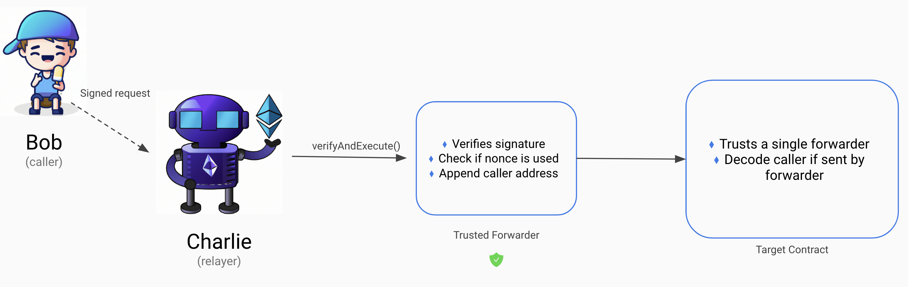

In an ideal world, web3 experiences should feel as seamless as web2. One of the first UX challenges for new web3 users is understanding the concept of gas. Here, we’ll explore ways to abstract gas costs from users and the technical methods to achieve this.

# Someone has to pay gas

Gas is essentially a fee for using blockchain resources and serves as a safeguard against spam. In Ethereum Virtual Machine (EVM), the gas payer is always the “from” address in a typical EIP-1559 transaction. To offload this cost from the user, we introduce a separate entity to submit the transaction, known as the relayer.

To achieve this, we must capture the user’s intent within the transaction’s data, creating what is known as a _meta-transaction_.

# Signature verification

To understand different approaches to meta-transactions, we need to look at where signature verification occurs. Signature verification ensures the user has approved the transaction.

Traditionally, validators check the user’s signature against the “from” address and the “v,r,s” fields when processing transactions on-chain.

With meta-transactions, validators verify the relayer’s signature, while the user’s signature is validated elsewhere.

# Implementing Meta-Transactions

There are three main approaches to implementing meta-transactions, each differing in where signature verification takes place.

1. EIP-2771: Secure protocol for native Meta Transactions

In this method, a smart contract known as the “trusted forwarder” handles user signature verification. Once verified, it forwards the transaction to the target contract, which confirms it’s from an authorized forwarder.

This approach depends on the target contract supporting EIP-2771 and specific [implementations](https://github.com/bcnmy/mexa/blob/master/contracts/6/forwarder/BiconomyForwarder.sol) of the trusted forwarder.

2. Contract wallets

Contract wallets can be enhanced with additional logic, including signature verification.

Here, any relayer can call a contract wallet, which verifies the user’s signature before proceeding to call the target contract if the signature is valid.

The lately popular [EIP-4337](https://eips.ethereum.org/EIPS/eip-4337#required-entry-point-contract-functionality) specifies a set of contracts that handles validating the meta-tx.

3. Custom architectures

Signature verification can happen anywhere, within a centralised backend, or within contracts.

One example is [USDC](https://polygonscan.com/token/0x2791bca1f2de4661ed88a30c99a7a9449aa84174#writeProxyContract) which verifies signature within the token contract itself.

1inch Fusion utilises a central backend that verifies user's swap orders and forwards them to their set of trusted workers/contracts.

# Choosing an approach

Selecting the right method for implementing meta-transactions depends on your specific use case and technical constraints:

- EIP-2771: Ideal if you have control over the target contract or can ensure it supports EIP-2771. Existing service providers such as Gelato, Bicononmy have production-ready  “trusted forwarders” simplifying development work.
- Contract Wallets: Suitable for any on-chain interactions without the need for modification to target contracts. Contract wallets may face challenges in user adoption and come with additional gas costs due to the complexity of the wallet logic.
- Custom Architectures: Use-case specific. This option allows signature verification to occur in a variety of locations, from centralized backends to smart contracts, offering tailored solutions for unique requirements but potentially increasing implementation complexity.

At BasedApp, we went with contract wallets as it enables us to integrate existing contracts like Uniswap and AAVE permissionlessly. A contract wallet enables 1-click swaps, invest and spend similar to how a banking application would. 